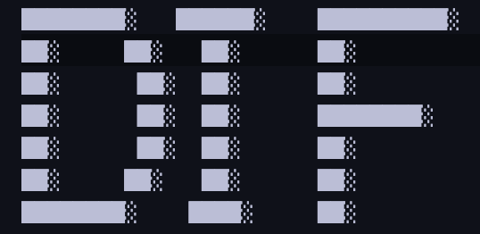

# Beautiful Soup practice

Just a simple program that takes in a url and reads the data from it.

We assume that the data is in a table. The data contains x-coordinate, a figure and y-coordinate.

A figure could be anything such as : ██ or █

These figures would then be mapped in a xy graph and that would spell out the secret word.

Note: I didn't upload the google doc link because I didn't want my drive link laying around on the web. Just because .. (?) 😬

The data would have 3 columns like so

x | code | y

0 | █ | 0
...

The decrypted secret code formed from coordinates could look like

